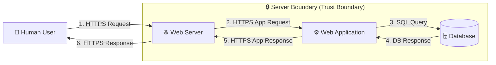

# System Architecture

## Application Description
The application is a web-based e-commerce system where users can browse products, log in, and perform various actions. It follows a client–server architecture.

## System Components

| Component | Type | Description |
|---|---|---|
| **Human User** | External Entity | Interacts with the system using a web browser |
| **Web Server** | Process | Handles HTTP/HTTPS requests and responses |
| **Web Application** | Process | Contains business logic; processes requests and interacts with the database |
| **Database** | Data Store | Stores application data such as users, products, orders, etc. |

## Data Flow Diagram (DFD)

**Data flow summary:**
1. User sends request → Web Server
2. Web Server forwards → Application
3. Application interacts → Database
4. Response returned → User

## Trust Boundary
The dashed boundary around the Web Server, Web Application, and Database represents the **server-side trust boundary** — everything inside is under the organization's control; everything outside (the human user / browser) is untrusted and must have its input validated at the boundary crossing.
