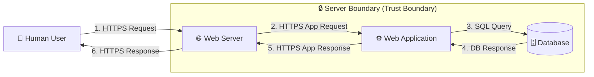

# 🧃 OWASP Juice Shop — Threat Modeling & Security Analysis

> A hands-on application security assessment of **OWASP Juice Shop**, using **STRIDE threat modeling**, manual exploitation, and **Burp Suite** validation — with working code-level fixes for every vulnerability found.

**Author:** Mahrukh ([@mahrukh89](https://github.com/mahrukh89))

---

## 📌 Project Summary

Web applications routinely ship with security flaws that attackers actively exploit. This project uses **OWASP Juice Shop** — an intentionally vulnerable e-commerce app built for security training — as a target to practice the full application security lifecycle:

1. Map the application's architecture and data flow
2. Identify threats systematically using **STRIDE**
3. Validate each threat with real exploitation (browser + Burp Suite)
4. Implement and test code-level fixes
5. Assess residual risk and document recommendations

This repo documents that process end-to-end, from initial recon to verified remediation.

---

## 🎯 Objectives

- [x] Understand the application architecture
- [x] Create a Data Flow Diagram (DFD)
- [x] Identify threats using the STRIDE methodology
- [x] Validate vulnerabilities through hands-on testing
- [x] Perform risk assessment (impact × likelihood)
- [x] Recommend and implement mitigation strategies

---

## 🏗️ System Architecture

Juice Shop follows a standard client–server web architecture:

| Component | Description |
|---|---|
| **Human User** (External Entity) | Interacts with the app through a web browser |
| **Web Server** | Handles incoming HTTP/HTTPS requests and responses |
| **Web Application** | Contains business logic; processes requests |
| **Database** | Stores users, products, orders, and other application data |

### Data Flow Diagram



📎 Full architecture write-up: [`architecture/OVERVIEW.md`](architecture/OVERVIEW.md)

---

## 🛡️ Threat Modeling (STRIDE)

STRIDE was applied against the DFD above to systematically surface risks across each threat category:

| STRIDE Category | Threat Identified |
|---|---|
| **S**poofing | Weak authentication — accounts could be created with trivial passwords |
| **T**ampering | XSS — user input fields allowed injection of malicious scripts |
| **R**epudiation | *(covered by session/token hardening below)* |
| **I**nformation Disclosure | Verbose errors exposed internal stack traces and system paths |
| **D**enial of Service | No rate limiting — login endpoint accepted unlimited attempts |
| **E**levation of Privilege | Hidden/admin pages (e.g. Score Board) reachable without authorization |

---

## 🔍 Vulnerabilities Found & Fixed

Each vulnerability has its own self-contained folder under [`fixes/`](fixes/) with the full description, cause, impact, code fix, and **before/after screenshots** together in one place:

| # | Vulnerability | STRIDE Category | Severity | Folder |
|---|---|---|:---:|---|
| 1 | Cross-Site Scripting (XSS) | Tampering | High | [`fixes/01-cross-site-scripting-xss/`](fixes/01-cross-site-scripting-xss/) |
| 2 | SQL Injection (Auth Bypass) | Tampering | Critical | [`fixes/02-sql-injection/`](fixes/02-sql-injection/) |
| 3 | No Rate Limiting (Brute Force) | Denial of Service | High | [`fixes/03-no-rate-limiting/`](fixes/03-no-rate-limiting/) |
| 4 | Sensitive Data Exposure (Token Leakage) | Information Disclosure | High | [`fixes/04-sensitive-data-exposure/`](fixes/04-sensitive-data-exposure/) |
| 5 | Broken Access Control (RBAC) | Elevation of Privilege | Critical | [`fixes/05-broken-access-control/`](fixes/05-broken-access-control/) |
| 6 | Weak Password Policy | Spoofing | Critical | [`fixes/06-weak-password-policy/`](fixes/06-weak-password-policy/) |

---

## 📊 Risk Assessment

| Threat | Impact | Likelihood | Severity |
|---|:---:|:---:|:---:|
| Weak Authentication | High | High | **Critical** |
| Cross-Site Scripting (XSS) | Medium | High | **High** |
| Sensitive Data Exposure | High | Medium | **High** |
| Broken Access Control / Privilege Escalation | Critical | Medium | **Critical** |

📎 Full risk breakdown + OWASP Top 10 mapping: [`docs/RISK_ASSESSMENT.md`](docs/RISK_ASSESSMENT.md)

---

## ✅ Mitigation & Recommendations

- Validate and sanitize all user input (client- and server-side)
- Use parameterized queries / ORM methods — never raw string SQL
- Enforce strong authentication: password policy, rate limiting, secure token storage
- Apply the principle of least privilege on all API endpoints
- Standardize error handling to avoid leaking stack traces or internal paths
- Enforce HTTPS everywhere
- Run recurring security testing (manual + automated) as part of the SDLC

---

## 🧰 Tools & Tech Used

- **Target application:** [OWASP Juice Shop](https://github.com/juice-shop/juice-shop) (Node.js/Express + Angular)
- **Containerization:** Docker
- **Interception/testing:** Burp Suite Community Edition
- **Methodology:** STRIDE threat modeling

---

## 📂 Repository Structure

```
owasp-juice-shop-threat-modeling/
├── README.md                              ← you are here
├── LICENSE
├── .gitignore
│
├── architecture/
│   └── OVERVIEW.md                        ← architecture, components, DFD
│
├── docs/
│   ├── THREAT_MODEL.md                    ← full STRIDE write-up
│   └── RISK_ASSESSMENT.md                 ← risk matrix + OWASP Top 10 mapping
│
└── fixes/
    ├── 01-cross-site-scripting-xss/
    │   ├── README.md                      ← what it is, cause, impact, fix, testing
    │   └── screenshots/                   ← before/after evidence for THIS fix only
    ├── 02-sql-injection/
    │   ├── README.md
    │   └── screenshots/
    ├── 03-no-rate-limiting/
    │   ├── README.md
    │   └── screenshots/
    ├── 04-sensitive-data-exposure/
    │   ├── README.md
    │   └── screenshots/
    ├── 05-broken-access-control/
    │   ├── README.md
    │   └── screenshots/
    └── 06-weak-password-policy/
        ├── README.md
        └── screenshots/
```

Each `fixes/xx-.../screenshots/` folder is where you drop that vulnerability's own before/after images — keeps everything about one issue in one place instead of a single giant screenshots dump.

---

## 🚀 Quick Start

See [`docs/SETUP.md`](docs/SETUP.md) *(setup guide)* for full Docker instructions. Short version:

```bash
docker pull bkimminich/juice-shop
docker run -d -p 3000:3000 --name juice-shop bkimminich/juice-shop
```

Then open **http://localhost:3000**.

---

## ⚠️ Disclaimer

This project was conducted against **OWASP Juice Shop**, an application intentionally designed to be vulnerable for security training and research. All testing was performed in a local, isolated environment. None of the techniques or findings here were used against systems without authorization.

## 📄 License

This project is licensed under the [MIT License](LICENSE).
