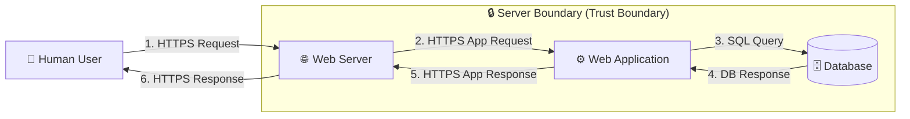

# 🧃 OWASP Juice Shop — Threat Modeling & Security Analysis

> A hands-on application security assessment of **OWASP Juice Shop**, using **STRIDE threat modeling**, manual exploitation, and **Burp Suite** validation — with working code-level fixes for every vulnerability found.

**Author:** Mahrukh ([@mahrukh89](https://github.com/mahrukh89))

---

## 📌 Project Summary

Web applications routinely ship with security flaws that attackers actively exploit. This project uses **OWASP Juice Shop** — an intentionally vulnerable e-commerce app built for security training — as a target to practice the full application security lifecycle:

1. Map the application's architecture and data flow
2. Identify threats systematically using **STRIDE**
3. Validate each threat with real exploitation (browser + Burp Suite)
4. Implement and test code-level fixes
5. Assess residual risk and document recommendations

This repo documents that process end-to-end, from initial recon to verified remediation.

---

## 🎯 Objectives

- [x] Understand the application architecture
- [x] Create a Data Flow Diagram (DFD)
- [x] Identify threats using the STRIDE methodology
- [x] Validate vulnerabilities through hands-on testing
- [x] Perform risk assessment (impact × likelihood)
- [x] Recommend and implement mitigation strategies

---

## 🏗️ System Architecture

Juice Shop follows a standard client–server web architecture:

| Component | Description |
|---|---|
| **Human User** (External Entity) | Interacts with the app through a web browser |
| **Web Server** | Handles incoming HTTP/HTTPS requests and responses |
| **Web Application** | Contains business logic; processes requests |
| **Database** | Stores users, products, orders, and other application data |

### Data Flow Diagram



---

## 🛡️ Threat Modeling (STRIDE)

STRIDE was applied against the DFD above to systematically surface risks across each threat category:

| STRIDE Category | Threat Identified |
|---|---|
| **S**poofing | Weak authentication — accounts could be created with trivial passwords |
| **T**ampering | XSS — user input fields allowed injection of malicious scripts |
| **R**epudiation | *(covered by session/token hardening below)* |
| **I**nformation Disclosure | Verbose errors exposed internal stack traces and system paths |
| **D**enial of Service | No rate limiting — login endpoint accepted unlimited attempts |
| **E**levation of Privilege | Hidden/admin pages (e.g. Score Board) reachable without authorization |

---

## 🔍 Vulnerabilities Found, Validated & Fixed

Each vulnerability below was **exploited before the fix** and **re-tested after the fix**, using both the live application and Burp Suite request interception.

### 1. Cross-Site Scripting (XSS) — *Tampering*
| | |
|---|---|
| **Location** | User comment/search fields |
| **Cause** | Inadequate context-aware output encoding |
| **Payloads tested** | `<script>alert('XSS')</script>`, `` |
| **Impact** | Session hijacking, credential theft, defacement |
| **Fix** | Angular's automatic escaping (`{{ comment.text }}` instead of `innerHTML`) + `xss-clean` middleware + server-side rejection of `<script>`/event-handler payloads |
| **Verified** | Burp confirmed payloads rendered as inert, HTML-escaped text post-fix |

### 2. SQL Injection — Authentication Bypass — *Tampering*
| | |
|---|---|
| **Location** | `/rest/user/login` |
| **Cause** | Raw string-built SQL queries with unsanitized user input |
| **Payload tested** | `' OR 1=1--` |
| **Impact** | Full authentication bypass, account takeover |
| **Fix** | Parameterized/ORM-based queries (Sequelize `replacements`), strict credential validation |
| **Verified** | Login correctly rejected the payload; Burp-replayed requests returned `401 Unauthorized` |

### 3. No Rate Limiting — Brute Force — *Denial of Service*
| | |
|---|---|
| **Location** | `/rest/user/login` |
| **Cause** | No throttling on repeated failed login attempts |
| **Impact** | Automated password guessing, account compromise |
| **Fix** | `express-rate-limit` middleware — **5 attempts / 1 minute**, HTTP `429` on excess |
| **Verified** | 10–15 rapid attempts blocked after threshold; Burp confirmed `429 Too Many Requests` |

### 4. Sensitive Data Exposure — Token Leakage — *Information Disclosure*
| | |
|---|---|
| **Location** | Login response (`/rest/user/login`) |
| **Cause** | Auth token returned in the JSON response body, exposed to JS/browser storage |
| **Impact** | Token theft via XSS or browser inspection → session hijacking |
| **Fix** | Token moved to an `httpOnly`, `secure`, `sameSite=strict` cookie; removed from response body |
| **Verified** | Token no longer visible in Network tab or Local/Session Storage |

### 5. Broken Access Control (RBAC) — *Elevation of Privilege*
| | |
|---|---|
| **Location** | `/api/users` and other protected endpoints |
| **Cause** | Missing authentication enforcement + verbose, inconsistent error handling |
| **Impact** | Unauthorized data access, internal detail leakage |
| **Fix** | Strict auth validation before request handling; standardized generic error responses |
| **Verified** | Unauthenticated requests now return a clean `401 Unauthorized` with no internal details |
| **OWASP mapping** | A01:2021 — Broken Access Control (**High** severity) |

### 6. Weak Password Policy — *Spoofing*
| | |
|---|---|
| **Location** | `server/models/User.ts` |
| **Cause** | No password strength validation before hashing/storage |
| **Impact** | Trivial dictionary/brute-force compromise of accounts |
| **Fix** | Sequelize model validation + regex enforcing 8+ chars, upper/lowercase, number, special character |
| **Verified** | `12345` and `password` rejected; `Mahrukh@123` accepted |

---

## 📊 Risk Assessment

| Threat | Impact | Likelihood | Severity |
|---|:---:|:---:|:---:|
| Weak Authentication | High | High | **Critical** |
| Cross-Site Scripting (XSS) | Medium | High | **High** |
| Sensitive Data Exposure | High | Medium | **High** |
| Broken Access Control / Privilege Escalation | Critical | Medium | **Critical** |

---

## ✅ Mitigation & Recommendations

- Validate and sanitize all user input (client- and server-side)
- Use parameterized queries / ORM methods — never raw string SQL
- Enforce strong authentication: password policy, rate limiting, secure token storage
- Apply the principle of least privilege on all API endpoints
- Standardize error handling to avoid leaking stack traces or internal paths
- Enforce HTTPS everywhere
- Run recurring security testing (manual + automated) as part of the SDLC

---

## 🧰 Tools & Tech Used

- **Target application:** [OWASP Juice Shop](https://github.com/juice-shop/juice-shop) (Node.js/Express + Angular)
- **Containerization:** Docker
- **Interception/testing:** Burp Suite Community Edition
- **Methodology:** STRIDE threat modeling

## 📂 Repository Structure

```
juice-shop-security-analysis/
├── README.md                  ← you are here
├── docs/
│   ├── THREAT_MODEL.md        ← full write-up: architecture, DFD, STRIDE, findings
│   ├── RISK_ASSESSMENT.md     ← risk matrix and severity ratings
│   └── SETUP.md               ← how to run Juice Shop locally via Docker
└── screenshots/               ← evidence captures (before/after fix, Burp Suite)
```

## 🚀 Quick Start

See [`docs/SETUP.md`](docs/SETUP.md) for full Docker setup instructions. Short version:

```bash
docker pull bkimminich/juice-shop
docker run -d -p 3000:3000 --name juice-shop bkimminich/juice-shop
```

Then open **http://localhost:3000**.

---

## ⚠️ Disclaimer

This project was conducted against **OWASP Juice Shop**, an application intentionally designed to be vulnerable for security training and research. All testing was performed in a local, isolated environment. None of the techniques or findings here were used against systems without authorization.

## 📄 License

This documentation is shared for educational purposes. OWASP Juice Shop itself is licensed under MIT by its original authors.
